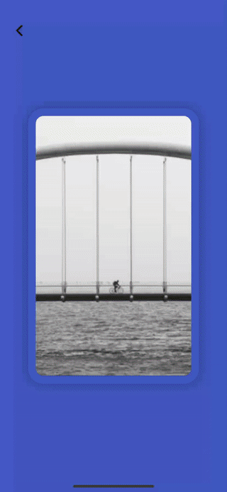
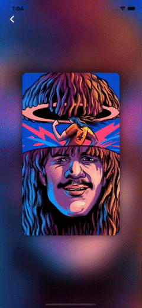
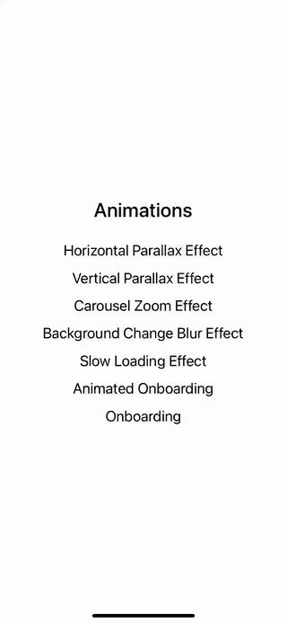
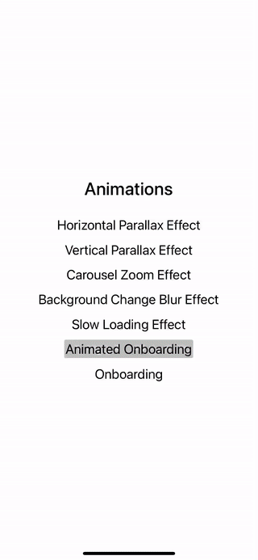

<p align="center">
  <a>
    
  </a>
  <h1 align="center">React Native Animations Examples</h1> 
</p>

---

## Introduction

A application to show different animation we can do in react native.

---

<br/>
<br/>

## :sparkles: Animations

- Horizontal Parallax Effect

- Vertical Parallax Effect

- Carousel Zoom Effect

- Background Change Blur Effect

- Slow Loading Effect

- Animated Onboarding

- Onboarding

<br/>
<br/>

## :camera_flash: Examples

<div align="center" style="margin:auto;width:100%;display:flex;justify-content:center;align-items:center;flex-wrap:wrap;">
<div style="width:250px;margin:20px">

<h3>Horizontal Parallax</h3>
</div>
<div style="width:250px;margin:20px">

<h3>Vertical Parallax</h3>
</div>
<div style="width:250px;margin:20px">

<h3>Carousel Zoom</h3>
</div>
<div style="width:250px;margin:20px">

<h3>Background Change Blur</h3>
</div>
<div style="width:250px;margin:20px">

<h3>Slow Loading</h3>
</div>
<div style="width:250px;margin:20px">

<h3>Animated Onboarding</h3>
</div>
<div style="width:250px;margin:20px">

<h3>Onboarding</h3>
</div>
</div>

<br/>
<br/>

## Development

```js bash
# Dependencies
yarn install
or
npm install

# Run IOS
yarn ios

# Run ANDROID
yarn android

```
